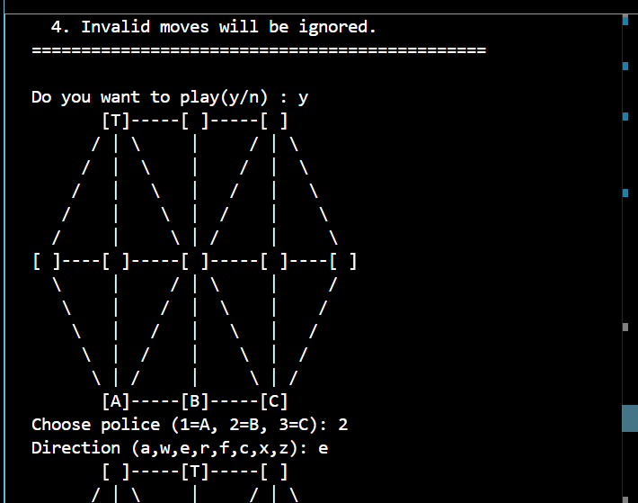
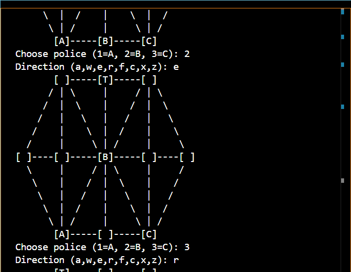
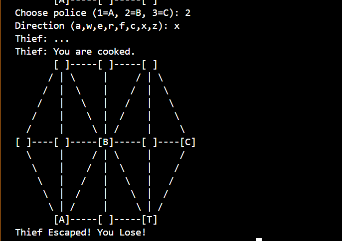
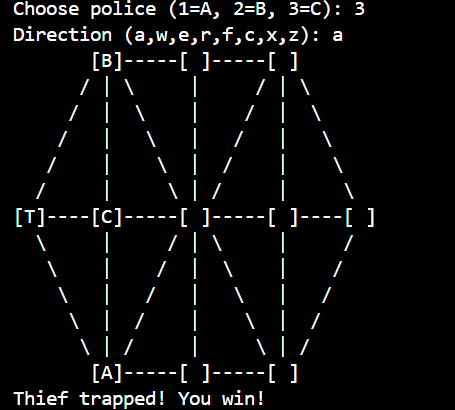

# Catch the Thief 👮‍♂️🦹‍♂️  

A **console-based C game** where 3 police officers try to trap a thief.  
The board is represented using **graphs and adjacency lists**, making it a fun project to practice **DSA concepts**.  

---

## 🎮 Gameplay
- Control **Police A, B, C** and stop the **Thief (T)**.  
- After your move, the thief moves automatically in a random direction.  
- **Win** if the thief is trapped.  
- **Lose** if the thief reaches a police’s starting position.  

### Controls
| Key | Direction     |
|-----|--------------|
| a   | Left         |
| w   | Top-Left     |
| e   | Top          |
| r   | Top-Right    |
| f   | Right        |
| c   | Bottom-Right |
| x   | Bottom       |
| z   | Bottom-Left  |

---
## 📸 Screenshots

### 1. Gameplay Start  
Initial setup: 3 police (A, B, C) vs the thief (T).  
  

---

### 2. Police Moving  
Player selects a police officer and moves it using direction keys.  
  

---

### 3. Thief Taunt  
Thief finds an escape and mocks the player.  
  

---

### 4. Police Win  
Police wins the game  
  


---

## 🚀 How to Build & Run

### Linux / macOS
```bash
git clone https://github.com/krishnasharma180/Catch_The_Thief.git
cd Catch_The_Thief
gcc -o game Catch_the_Thief.c
./game
```
### On Windows
```bash
cd Catch_The_Thief
gcc -o game.exe Catch_the_Thief.c
.\game.exe

```
---
## 📚Concepts Used

- Graphs & adjacency lists.
- Randomized movement.
- Turn-based game loop.

---
## 🔮 Future Ideas

- Add GUI version.
- Smarter thief AI.
- Multiple levels.

---
## 📜 License
- MIT License. Do whatever you like with it.
